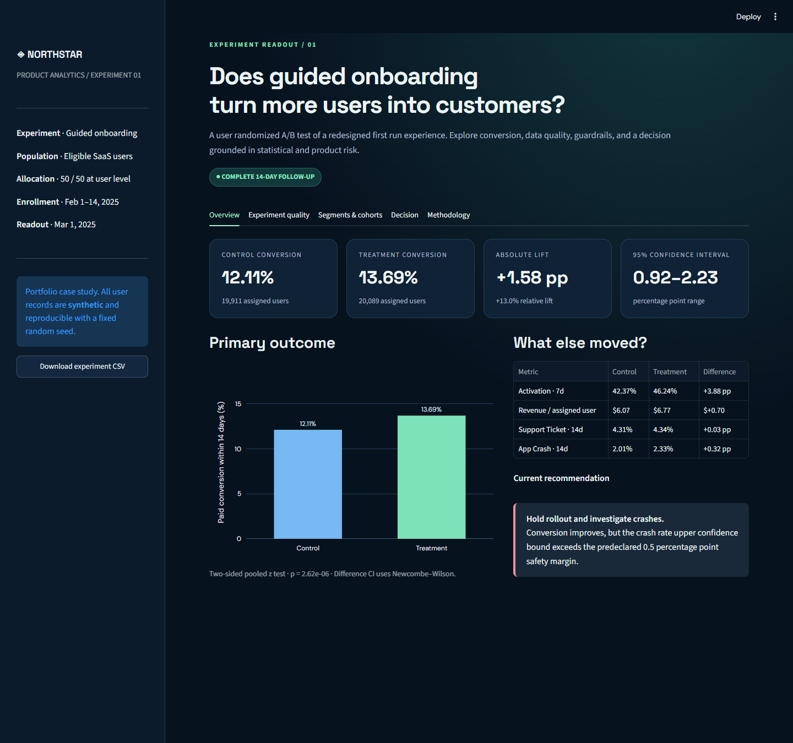
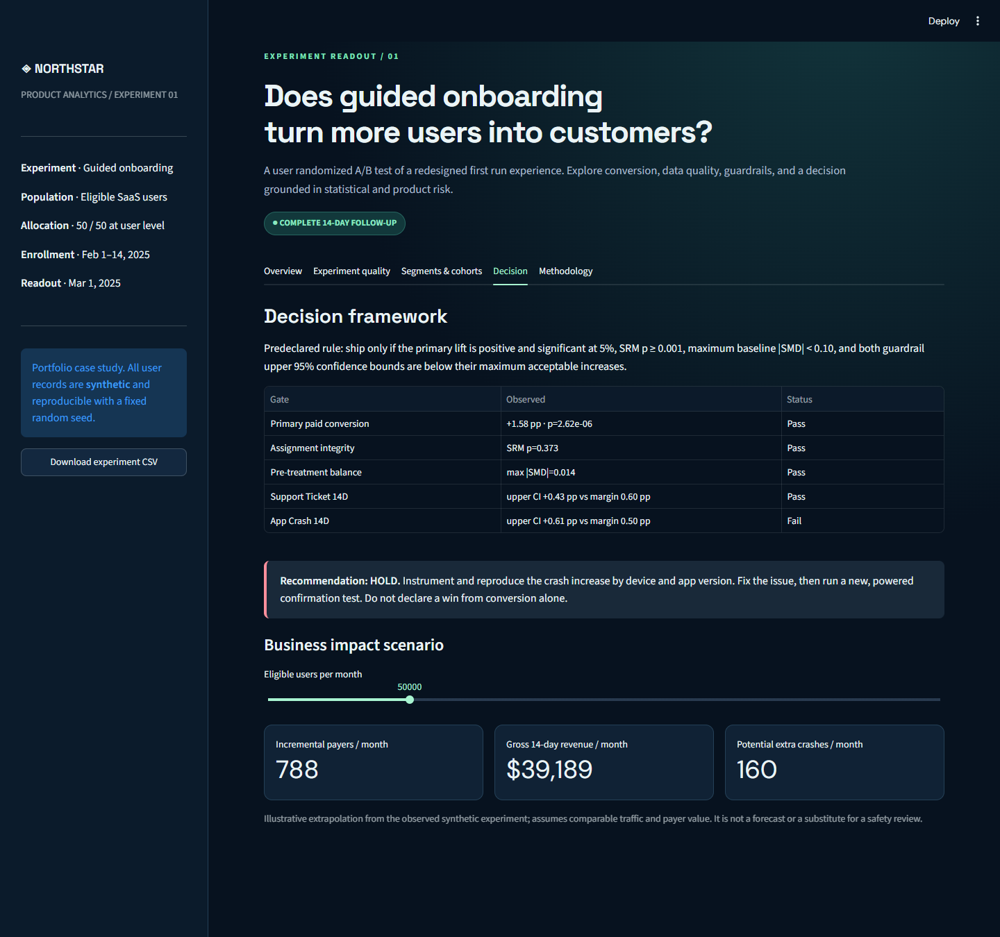

# A/B Testing & Product Experimentation

**A complete SaaS onboarding experiment case study for a Data Analyst portfolio.** This repository takes a randomized product test from metric design and data validation through SQL, statistical inference, guardrails, and a launch recommendation. The 40,000 user records are **synthetic**, generated with a fixed seed; no real customer or public experiment data is represented.



## Executive readout

| Question | Result |
| --- | ---: |
| Assigned users | 19,911 control / 20,089 treatment |
| 14-day paid conversion | 12.11% control / 13.69% treatment |
| Absolute effect | **+1.58 percentage points** (95% CI +0.92 to +2.23) |
| Relative lift | +13.0% |
| Primary two-sided p-value | 0.00000262 |
| Sample ratio mismatch | p = 0.373; pass at 0.001 alarm threshold |
| 80% power MDE | 0.93 percentage points at realized baseline and smaller arm |
| App crash guardrail | +0.32 pp; 95% upper bound +0.61 pp versus +0.50 pp margin |
| Decision | **Hold rollout and investigate app crashes** |

The conversion gain is statistically clear, yet the crash guardrail does not rule out harm beyond its prespecified tolerance. A real product team should investigate the issue, repair it, and run a new confirmation test before launch. This is a simulated result, not a claim about a real SaaS company.



## Skills demonstrated

- Experiment design: user-level randomization, intent-to-treat estimand, fixed exposure window, primary/secondary/guardrail metrics, decision criteria.
- Data quality: uniqueness and outcome validation, sample ratio mismatch, allocation drift, pre-treatment balance.
- Statistics: two-proportion z test, Newcombe–Wilson confidence interval, absolute and relative effect, unequal-variance revenue inference, power and minimum detectable effect.
- Multiple comparisons: Holm adjusted secondary/guardrail diagnostics; Benjamini–Hochberg adjusted exploratory segment views.
- Product judgment: explicit harm margins, a restrained launch recommendation, and an illustrative business impact scenario.
- Delivery: interactive Streamlit dashboard, SQL analysis, reproducible generator, tests, and CI.

## Repository map

```text
app.py                     Streamlit dashboard
data/experiment_users.csv  Published synthetic user-level dataset
data/DATA_DICTIONARY.md    Field definitions and generation assumptions
src/generate_data.py       Deterministic data generator
src/analysis.py            Statistical analysis and decision logic
src/report.py              Command-line readout
src/run_sql.py             Runs all SQL files in an in-memory SQLite database
sql/                       Integrity, funnel, cohort/segment, guardrail queries
tests/                     Automated analysis and SQL reconciliation tests
EXPERIMENT_PLAN.md         Metrics, margins, power, and decision rules
assets/                    Dashboard screenshots
```

## Run locally

Use Python **3.11** (selected in `.python-version`). Dependency ranges in `requirements.txt` allow compatible patch updates; for exact reproduction, record your installed versions with `python -m pip freeze` in your own environment. The checked-in data and fixed seed reproduce the portfolio results.

```bash
python -m venv .venv
# Windows PowerShell: .venv\Scripts\Activate.ps1
# macOS/Linux: source .venv/bin/activate
python -m pip install -r requirements.txt
python -m src.generate_data
python -m src.report
python -m src.run_sql
python -m pytest -q
python -m streamlit run app.py
```

Open the local URL printed by Streamlit. The dashboard also provides a CSV download. The SQL runner loads the same CSV into an in-memory SQLite table named `experiment_users`, so no database account is needed.

## Deploy to Streamlit Community Cloud

1. Push this repository to a public GitHub repository, with `app.py`, `requirements.txt`, `data/`, and `.streamlit/config.toml` at the repository root.
2. Sign in at [Streamlit Community Cloud](https://share.streamlit.io/) with GitHub. Select **Create app** and choose the repository, `main` branch, and `app.py` as the entrypoint.
3. In **Advanced settings**, select Python **3.11** to match `.python-version`. The app needs no secrets.
4. Deploy, wait for the build to complete, open the public `*.streamlit.app` URL in a private browser window, and verify the charts, tabs, and CSV download. Add that verified URL to this README.

Streamlit's [deployment guide](https://docs.streamlit.io/deploy/streamlit-community-cloud/deploy-your-app/deploy), [file organization guide](https://docs.streamlit.io/deploy/streamlit-community-cloud/deploy-your-app/file-organization), and [dependency guide](https://docs.streamlit.io/deploy/streamlit-community-cloud/deploy-your-app/app-dependencies) describe the current flow.

**Live dashboard:** Pending deployment and public URL verification.

## Methods and limitations

The primary test uses a two-sided pooled z statistic with α = 0.05 and a Newcombe hybrid Wilson confidence interval for the unpaired difference in proportions. The launch rule requires a positive significant primary effect, SRM p ≥ 0.001, maximum baseline category |SMD| < 0.10, and guardrail upper 95% bounds below prespecified harm margins. A nonsignificant guardrail p-value alone is not considered safety evidence. Revenue is analyzed per assigned user, including zero spend.

The generated data assume complete 14-day follow-up and independent assignment. In a production experiment, logging, identity stitching, bot filtering, missing outcomes, interference, sequential monitoring, and longer-term retention require additional investigation. Segment results are exploratory and are not proof of heterogeneous treatment effects. See [the experiment plan](EXPERIMENT_PLAN.md) and [data dictionary](data/DATA_DICTIONARY.md).

## Interview talking points

1. **Why did you hold the rollout when conversion increased?** The prespecified crash upper bound exceeded the harm margin; shipping would ignore uncertainty about product quality.
2. **Why include all assigned users in revenue and conversion denominators?** Intent-to-treat preserves the randomized comparison and avoids selecting on post-assignment behavior.
3. **How would you improve the real experiment?** Audit crash instrumentation by variant/device/version, estimate long-term value and support cost, rerun after a fix, and plan sample size from historical data before launch.

## License

MIT. The data are synthetic and may be used for learning and portfolio demonstrations with the synthetic label retained.
